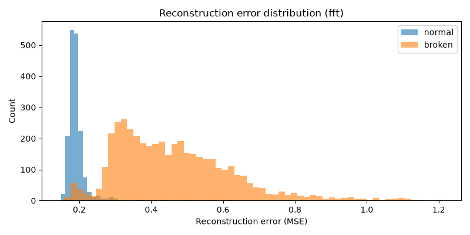

# Drone Anomaly Detection

This repo contains notebooks and code for detecting propellor failure in drones in realtime using an autoencoder. It's a capstone project for the TinyML course at TU Hamburg-Harburg. This work is based on the [UAV Propellor Anomaly Audio Dataset](https://github.com/tiiuae/UAV-Propeller-Anomaly-Audio-Dataset) provided by TII UAE in [Katta et al., 2022](https://ieeexplore.ieee.org/document/9747789). 

## Structure
- `dataset`: contains the raw data used
- `processing`: contains the code for preprocessing the data
- `training`: contains the code for training the autoencoder

# Todos
- Plot reconstruction  loss on anomalous data over epochs. Should go up if model is training well. 
- Need to run grid search for neural net hyperparameters. 
- Try filtering out higher frequencies
- Don't trust Edge Impulse profiler (esp. for autoencoder).
- Just run the model on Arduino separate from the drone. 